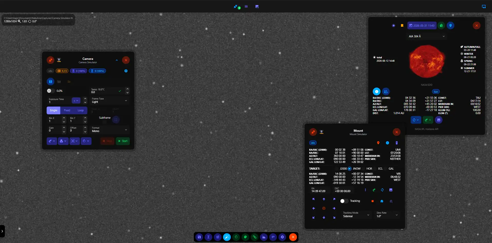

# Nebulosa

[](https://gist.github.com/cheerfulstoic/d107229326a01ff0f333a1d3476e068d)
[](https://github.com/tiagohm/nebulosa.app/actions/workflows/ci.yml)

Nebulosa is an integrated astronomical imaging application built with Bun, React, and the [`nebulosa`](https://github.com/tiagohm/nebulosa.ts) TypeScript astronomy toolkit. It combines a local web UI, Bun API server, device-control handlers, and image-processing workflows for capture, planning, solving, and analysis.



## Features

- Local Bun server with a React web interface.
- INDI device orchestration for cameras, mounts, focusers, filter wheels, rotators, covers, flat panels, dew heaters, thermometers, and guide outputs.
- Multiple simultaneous device connections.
- Alpaca-compatible device endpoints, including the ability to start an Alpaca server that hosts the currently connected devices.
- PHD2 integration for guiding workflows.
- Capture helpers for autofocus, flat wizard, TPPA, DARV, framing, and plate solving.
- Image workspace for opening, inspecting, debayering, stretching, filtering, annotating, solving, saving, and processing astronomical images.
- Image transformation tools for calibration, adjustments, Kernel and FFT filters, mirroring, and color inversion.
- Image analysis and interaction tools including crosshair, ROI selection, statistics, and annotation overlays.
- Atlas tools for solar and lunar eclipses, real-time Sun imagery from NASA SDO, seasons, Moon phases, apogee and perigee events, NEO search, satellites, Earth orientation data, and real-time ephemerides from NASA Horizons.
- Calculator with several useful astronomy, optics, sensor, and environment formulas.
- Bun-native executable build for production use.

## Requirements

- [Bun](https://bun.com/) installed locally.
- An INDI or Alpaca-compatible device environment for hardware-control workflows.
- Optional certificate and key files when serving over HTTPS.

## Install

```bash
bun i
```

For a production-only install:

```bash
bun i --production
```

## Run

Start the development server with hot reloading:

```bash
bun dev
```

Start the production server:

```bash
bun prod
```

By default, the app listens on `http://localhost:1234`.

## Server Options

Runtime options can be passed as CLI flags or environment variables:

| CLI flag | Environment variable | Default | Description |
| --- | --- | --- | --- |
| `--host`, `-h` | `host` | `localhost` | Server host name. |
| `--port`, `-p` | `port` | `1234` | Server port. |
| `--secure`, `-s` | `secure` | `false` | Enable HTTPS. |
| `--cert`, `-c` | `cert` | `cert.pem` | TLS certificate path. |
| `--key`, `-k` | `key` | `key.pem` | TLS key path. |
| `--open`, `-o` | `open` | `false` | Open the app in the default browser after startup. |
| `--dir`, `-d` | `appDir` | platform-specific | Override the application data directory. |
| `--username`, `-u` | `username` | empty | Reserved for server authentication configuration. |
| `--password` | `password` | empty | Reserved for server authentication configuration. |
| `--alpaca`, `-a` | `alpaca` | `false` | Enable Alpaca routes. |
| `--alpacaPort` | `alpacaPort` | app server port | Alpaca API port override. |
| `--alpacaDiscoveryPort` | `alpacaDiscoveryPort` | automatic | Alpaca discovery port override. |

Example:

```bash
bun dev --host 0.0.0.0 --port 4321 --open --alpaca
```

## Application Data

Nebulosa creates its runtime directories on startup:

- Windows: application data under `%LOCALAPPDATA%\Nebulosa`, captures under `Documents\Nebulosa\Captures`.
- Linux: application data under `~/.nebulosa`, captures under `~/.nebulosa/captures`, temporary files under `/dev/shm/nebulosa`.

Use `--dir` or `appDir` to override the base application directory.

## Development

Useful project commands:

```bash
bun run fmt
bun run fmt:check
bun run lint
bun test
```

Build the production-ready executable:

```bash
bun run compile
```

The compiled artifact is written as `nebulosa.exe` on Windows and `nebulosa.out` on other platforms.

## Project Layout

- `main.ts` wires startup, CLI/env configuration, handlers, routes, WebSocket messaging, and scheduled refresh jobs.
- `src/api` contains Bun route handlers and backend services.
- `src/web` contains the React UI, stores, hooks, shared browser utilities, and page entrypoints.
- `src/shared` contains cross-layer types and utilities.
- `tests/api` contains Bun API tests.
- `scripts` and `bin` contain repository maintenance and data-generation scripts.

## License

Nebulosa is released under the [MIT License](LICENSE).
