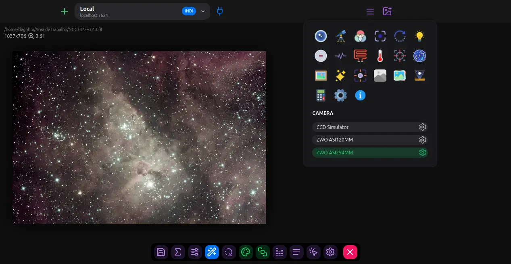

# Nebulosa

The complete integrated solution for all of your astronomical imaging needs.

[](https://gist.github.com/cheerfulstoic/d107229326a01ff0f333a1d3476e068d)



To install dependencies:

```bash
bun i
```

To start a development server:

```bash
bun dev
```

To generate a production-ready executable:

```bash
bun compile
```
